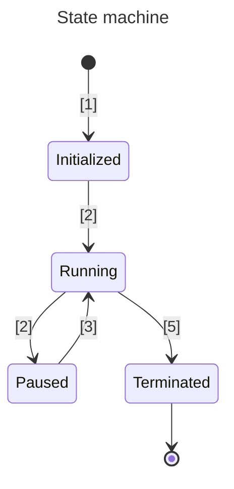

# DAP GUI

Very early prototype of a general purpose GUI debugger based on the [DAP][dap] protocol and [egui]([url](https://github.com/emilk/egui)).

https://github.com/simonrw/dap-gui/assets/59756/a31d6a97-431f-48b7-a051-baac3ca9b167

## Motivation

This repository exists because I do not like any of the debuggers I (currently) use day to day. I have tried:

* pycharm
* vs code
* neovim dap

They do not feel right to me.

My hope with this project is to create a general purpose GUI on top of the [DAP][dap] protocol that I like to use.

## Features

* fast
* stable
* TBD

## Internals

WIP

### Code layout and architecture

* `transport` crate:
  * serialisation and deserialisation of wire protocol
  * send messages with and without responses
  * publish received events
* `debugger` crate:
  * high level controls like `continue`
  * breakpoint management
  * initialisation of debugger state
* `server` crate:
  * abstraction over running DAP servers
* `pcaplog` crate:
  * print messages from pcap(ng) captures (prototype)

### States and transitions

1. Initializing
    * Set up initial state

[dap]: https://microsoft.github.io/debug-adapter-protocol/

