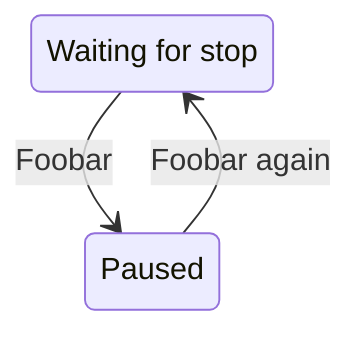

# DAP GUI

Very early prototype of a general purpose GUI debugger based on the DAP protocol and [egui]([url](https://github.com/emilk/egui)).

https://github.com/simonrw/dap-gui/assets/59756/f548c4d1-7dcd-4dd3-a2b6-3469541e7b68

