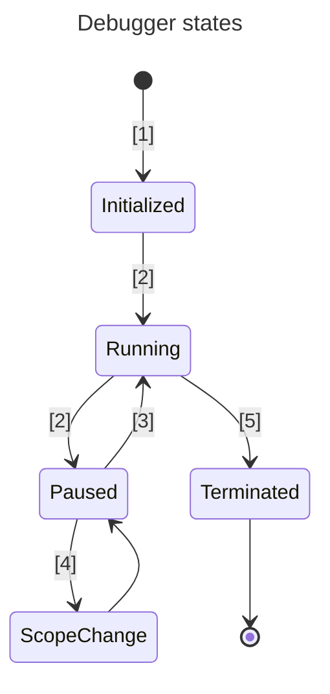

# dap-tui

[](https://github.com/simonrw/dap-gui/actions/workflows/test.yml)

A terminal debugger built on the [Debug Adapter Protocol][dap]. Works with any DAP-compatible debug adapter (debugpy, codelldb, delve, and more).


## Features

- Syntax-highlighted code view with vim-style navigation
- Variables panel with tree expand/collapse for nested objects
- Call stack navigation with frame switching
- Breakpoints: add, delete, and jump to source
- Inline expression evaluation on any line
- REPL for evaluating arbitrary expressions while paused
- Output panel with color-coded stdout/stderr
- Fuzzy file picker
- In-file search
- Zen mode: maximize the code view
- Configurable keybindings via TOML config file
- Help overlay with full keybinding reference

## Installation

### From release binaries

Download the latest release for your platform from the [releases page](https://github.com/simonrw/dap-gui/releases).

### From source

```
cargo install --git https://github.com/simonrw/dap-gui -p dap-tui
```

### Requirements

A DAP-compatible debug adapter for your language. For example:

- Python: `pip install debugpy`
- Go: `go install github.com/go-delve/delve/cmd/dlv@latest`
- C/C++/Rust: install [codelldb](https://github.com/vadimcn/codelldb)

## Quick start

1. Create a `launch.json` in your project directory (VS Code format):

```json
{
  "version": "0.2.0",
  "configurations": [
    {
      "name": "Launch",
      "type": "debugpy",
      "request": "launch",
      "program": "your_script.py"
    }
  ]
}
```

2. Run the debugger:

```
dap-tui launch.json
```

Or with an initial breakpoint:

```
dap-tui launch.json -n Launch -b your_script.py:10
```

## Keybindings

### Global

| Key | Action |
|-----|--------|
| `?` | Toggle help overlay |
| `q` / `Ctrl+C` | Quit |
| `Tab` / `Shift+Tab` | Cycle panel focus |
| `Alt+1/2/3` | Switch bottom tab |
| `Ctrl+P` | File picker |
| `Ctrl+F` / `/` | Search in file |
| `z` | Toggle zen mode |

### Debugger

| Key | Action |
|-----|--------|
| `F5` | Start / Continue |
| `F10` | Step Over |
| `F11` | Step In |
| `Shift+F11` | Step Out |
| `Shift+F5` | Stop |

### Code view

| Key | Action |
|-----|--------|
| `j/k` | Move cursor |
| `Ctrl+D/U` | Half-page down/up |
| `g` / `G` | Top / bottom of file |
| `b` | Toggle breakpoint at cursor |
| `e` | Evaluate line/selection inline |
| `x` | Clear inline annotations |
| `v` | Visual line selection |
| `n` / `N` | Next / prev search match |

### Panels

| Key | Action |
|-----|--------|
| `Enter` / `l` | Expand variable |
| `h` | Collapse variable |
| `y` | Yank variable value |
| `a` | Add breakpoint |
| `d` / `Del` | Delete breakpoint |
| `Ctrl+E` | Open evaluate popup |

All keybindings can be customized via `~/.config/dap-tui/keybindings.toml`.

## Architecture

### Code layout

- `async-transport`: serialisation/deserialisation of the DAP wire protocol, message sending and event publishing
- `debugger`: high level controls (continue, step, etc.), breakpoint management, debugger state machine
- `server`: abstraction over running DAP server processes
- `tui`: terminal interface built with [ratatui](https://github.com/ratatui/ratatui)
- `ui-core`: shared bootstrap logic and CLI argument parsing
- `config`: configuration file loading and keybinding definitions
- `state`: cross-session state persistence
- `launch_configuration`: launch configuration parsing (e.g. VS Code `launch.json`)
- `fuzzy`: fuzzy matching for file picker
- `dap-types`: DAP protocol type definitions
- `pcaplog`: print messages from pcap(ng) captures (diagnostic tool)

### States and transitions


```mermaid
---
title: Debugger states
---

stateDiagram-v2
    [*] --> Initialized: [1]
    Initialized --> Running: [2]
    Running --> Paused: [2]
    Paused --> Running: [3]
    Paused --> ScopeChange: [4]
    ScopeChange --> Paused
    Running --> Terminated: [5]
    Terminated --> [*]
```

[dap]: https://microsoft.github.io/debug-adapter-protocol/
